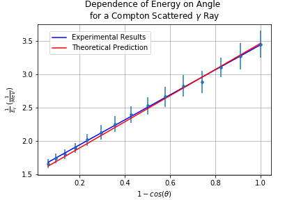
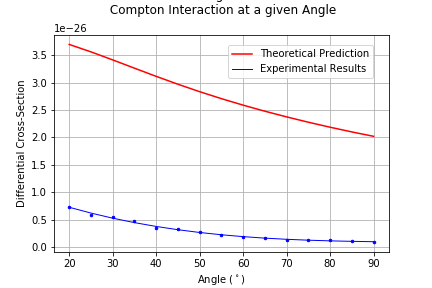
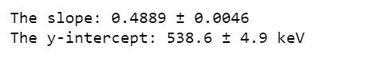
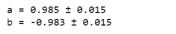

# Compton Scattering
## Experimental Abstract 
The energy spectra for Compton scattered gamma rays are recorded at a range of angles using a NaI(Tl) detector and are used to show that the energy of the scattered ray depends on the deflection angle. This validates that the particles associated with Compton interaction obey the laws of conservation of energy and momentum. The differential cross-section for Compton scattering is also analysed from such spectra to prove that the probability of the gamma ray being scattered at a particular angle decreases as the angle itself increases. A high purity germanium detector is then used to produce detailed energy spectra for a range of gamma rays from various sources. Each of which have undergone a 180° Compton interaction allowing for the kinetic energy of the recoiling electron to be measured. As the rest mass energy of the electron is determined from such data, a relativistic dependency between the energy and momentum is revealed. This new relativistic understanding allows for a dependency on β to be shown for momentum, energy and the Lorentz factor. 
## Data Analysis
### Section 1 - Dependence of energy on angle for a Compton scattered 𝜸 ray
In this section the variation in energy of the scattered gamma rays with respect to their angles of deflection are analysed. The plot produced below compares the expected theoretical results (red) against the actual experimental values (blue) recorded. Along with this, an [analytical comparison](https://github.com/ruairibrady/Compton-Scattering/blob/master/Outputs/output1.1.PNG) was produced to compare the results numerically. The source code and data file used to produce these can found in [Directory 1](https://github.com/ruairibrady/Compton-Scattering/tree/master/1.%20Gamma%20Ray%20Energy%20vs%20Angle/).

  

### Section 2 - Differential scattering cross-section for the Compton interaction at a given angle
In this section the differential cross-section for Compton scattering is assessed. The plot shown below represents the probability of an incoming photon being Compton scattered at a particular angle. The theoretical prediction using the Klein-Nishina formula is plotted in red whilst the experimental results are plotted in blue. The source code and data file used to produce this can be found in [Directory 2](https://github.com/ruairibrady/Compton-Scattering/tree/master/2.%20Differential%20Cross%20Section%20vs%20Angle/).

  

  
  
  

